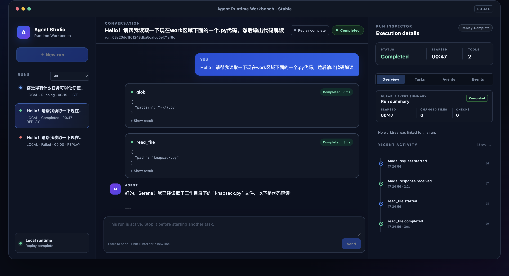
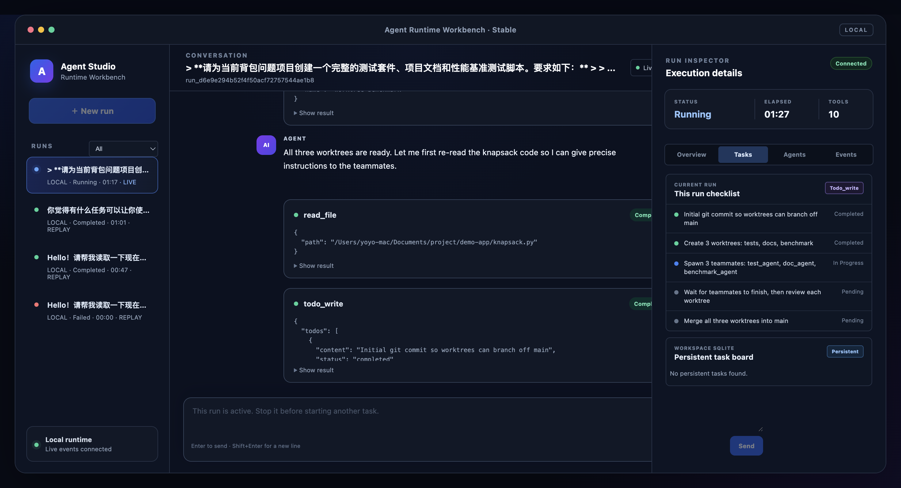
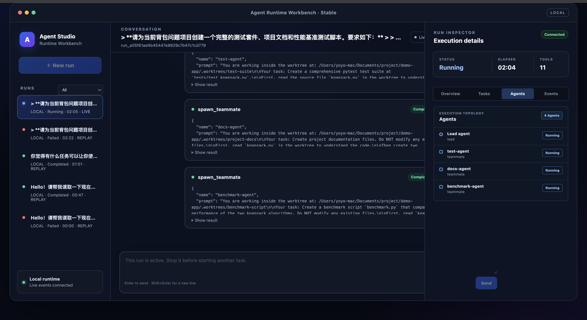

# Agent Runtime Workbench

A local workbench for building, running, and observing a coding agent runtime.

Agent Runtime Workbench combines a Python agent core, a FastAPI runtime API, and
a React/Vite inspector UI. It is designed as a learning project for exploring
how coding agents handle tools, memory, permissions, background work, task
state, worktree isolation, and multi-agent collaboration.



## What It Does

- Runs a local coding-agent loop from the terminal or from the web UI.
- Streams live run events into a browser with Server-Sent Events.
- Shows model messages, tool calls, tool results, run status, elapsed time, and
  recent activity in one inspector view.
- Persists run history and runtime state with SQLite.
- Supports task/todo state, memory, skills, hooks, permissions, background
  tasks, cron scheduling, and error recovery.
- Experiments with teammate agents, worktree isolation, worktree review, and
  merge-oriented coding workflows.

## Screenshots

### Run Overview

The main conversation view shows user prompts, assistant responses, tool calls,
run status, elapsed time, and durable event history.


### Task Inspector

The inspector can switch between overview, task board, agents, and event tabs.
Tasks expose what the runtime is planning and what has already completed.



### Agent Topology

Multi-agent runs can spawn teammate agents for focused work such as tests,
documentation, benchmarks, or code review.



## Tech Stack

- Backend: Python, FastAPI, SQLite
- Frontend: React, TypeScript, Vite
- Runtime: Anthropic-compatible chat API, local filesystem tools, event stream
- Tests: pytest, Vitest, Testing Library

## Quick Start

### 1. Clone The Repository

```bash
git clone https://github.com/YOUR_USERNAME/agent-runtime-workbench.git
cd agent-runtime-workbench
```

### 2. Configure Environment Variables

```bash
cp .env.example .env
```

Edit `.env` and fill in your local settings:

```bash
ANTHROPIC_API_KEY=your_api_key_here
ANTHROPIC_BASE_URL=https://dashscope.aliyuncs.com/apps/anthropic
MODEL=qwen3.7-plus
FALLBACK_MODEL=qwen3.7-max
AGENT_WORKDIR=/path/to/your/project
```

`.env` is intentionally ignored by Git. Keep secrets local.

### 3. Install Backend Dependencies

```bash
python3 -m venv .venv
source .venv/bin/activate
pip install -r requirements.txt
```

### 4. Start The Backend API

```bash
uvicorn agent.api.app:app --reload --host 127.0.0.1 --port 8000
```

You can verify the API with:

```bash
curl http://127.0.0.1:8000/api/health
```

### 5. Start The Frontend

Open a second terminal:

```bash
cd frontend
npm install
npm run dev
```

Then open:

```text
http://127.0.0.1:5173
```

The Vite dev server proxies `/api` requests to `http://127.0.0.1:8000`.

## Terminal Mode

You can also run the agent directly from the command line:

```bash
source .venv/bin/activate
python -m agent
```

Type a task and press Enter. Type `q` or `exit` to leave.

## Project Structure

```text
agent/
  api/          FastAPI app, REST routes, SSE event streaming
  database/     SQLite-backed stores for runs, tasks, teams, worktrees
  features/     Agent capabilities such as memory, todos, skills, teams
  runtime/      Agent loop, messages, events, compaction, CLI
  tooling/      Tool schemas, handlers, permissions, hooks
  tests/        Backend test suite

frontend/
  src/          React UI, runtime API client, inspector components
  package.json  Frontend scripts and dependencies

docs/images/    README screenshots
s01_...s20_*/   Tutorial chapter snapshots and experiments
```

## Useful Commands

Run backend tests:

```bash
pytest agent/tests
```

Run frontend tests:

```bash
cd frontend
npm test
```

Build the frontend:

```bash
cd frontend
npm run build
```

## Status

This is a local-first learning project and runtime workbench. The UI and runtime
are already useful for observing agent behavior, while the chapter directories
document the incremental path from a small agent loop toward a fuller coding
agent system.

## Security Notes

- Do not commit `.env`, API keys, local databases, or worktree state.
- Point `AGENT_WORKDIR` at a project directory you are comfortable letting the
  agent read and modify.
- Review tool calls and permission behavior before using it on important code.

