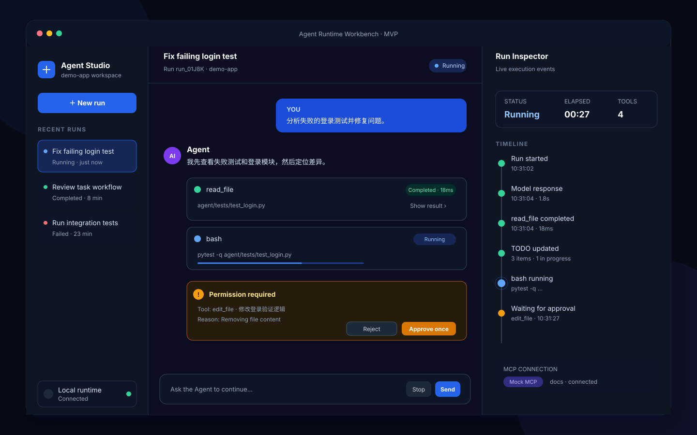
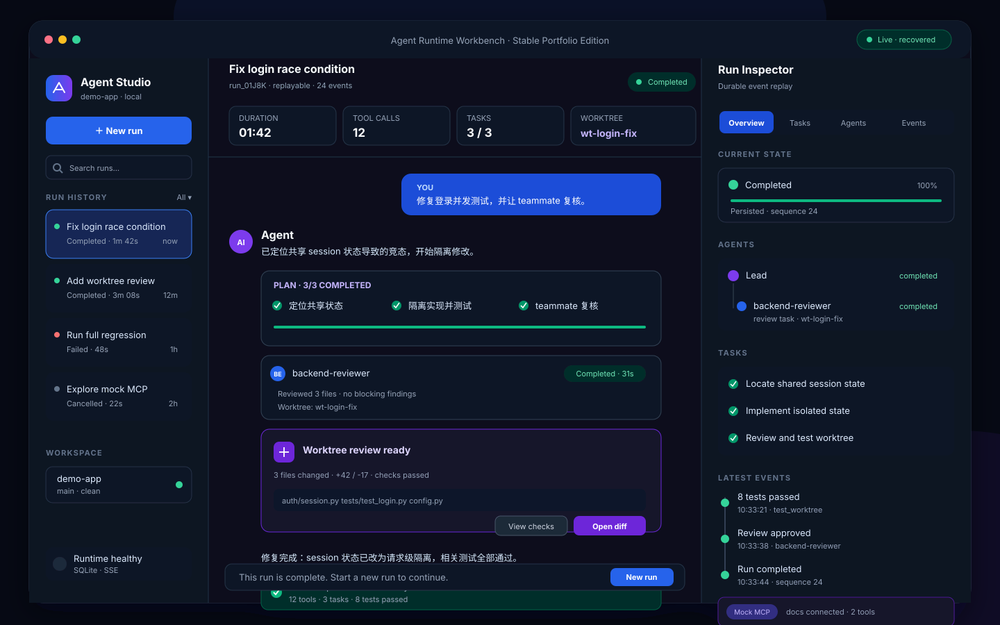

# Agent Runtime Workbench 前端设计方案

> 状态：MVP 已完成，稳定版正在按步骤实现  
> 前端技术约束：React + TypeScript，代码统一放在 `frontend/` 目录  
> 产品定位：用于演示当前 Agent 的真实能力，不追求通用 SaaS、多租户或完整运维平台
> 实现进度：MVP 步骤 0–10 已完成；稳定版步骤 S0–S8 已完成，S9 待实现

## 1. 设计结论

采用三栏式 **Agent Runtime Workbench**：

- 左栏管理会话和运行记录；
- 中栏承担类似 GPT / Claude 的任务输入与对话；
- 右栏展示 Agent 的实时执行轨迹，而不是模型的隐藏思维过程；
- 危险操作通过可操作的权限卡片完成 human-in-the-loop；
- 稳定版在相同布局上增加持久化、断线恢复、子 Agent、任务和 worktree review，不重新设计另一套产品。

这个方向的重点不是“做一个聊天壳”，而是把仓库已经具备的工具调用、TODO、后台任务、团队协作、权限、worktree 和 mock MCP 能力变成可观察、可操作、可回放的用户体验。

## 2. 范围和原则

### 2.1 必须保留的设计原则

1. **真实链路优先**：UI 展示的数据必须来自真实 Agent 运行事件，不能用前端定时器伪造工具执行。
2. **CLI 继续可用**：Web 接入通过可选的 runtime context/event sink 完成，不能把现有 CLI 强行改造成 HTTP 专用代码。
3. **不展示隐藏思维链**：只展示模型消息、工具输入摘要、工具结果摘要、状态、耗时、错误和审批记录。
4. **单页优先**：MVP 不做独立数据大盘；稳定版也以同一个三栏工作台为主。
5. **桌面端优先**：简历演示以 1280px 以上桌面浏览器为目标，MVP 不投入移动端适配。
6. **mock 能力显式标注**：当前 MCP 是进程内 mock，UI 必须显示 `Mock MCP`，不能暗示已连接真实 MCP Server。

### 2.2 明确不做

- 登录、注册、组织和多租户；
- 云端计费、配额和 token 成本结算；
- 完整的 Agent 配置中心；
- 移动端和 PWA；
- 复杂 BI 图表；
- 浏览器内代码编辑器；
- 真实 MCP Server 管理；
- 任意数量并发运行。

---

# 第一部分：最小可演示版本（MVP）

## 3. MVP 目标

MVP 只回答一个问题：**用户能否在浏览器里下达任务，并实时看到这个 Agent 如何完成任务？**

建议演示路径：

1. 用户新建一个 run，输入“分析失败测试并修复”；
2. 中栏出现用户消息和 Agent 回复；
3. 右栏依次出现模型请求、`read_file`、`edit_file`、`bash` 等结构化事件；
4. TODO 以工具事件或摘要卡片展示；
5. 遇到需要确认的操作，中栏出现 Approve / Reject 卡片；
6. run 最终进入 completed、failed 或 cancelled 状态；
7. 左栏保留本次浏览器进程中的最近运行。

MVP 的“实时”指运行事件通过 SSE 逐条到达。当前模型调用是同步的，因此第一版不要求 token-by-token 输出；一轮模型响应完成后发送完整的 `assistant.message` 事件即可。

## 4. MVP UI 设计



### 4.1 左栏：Runs

- 产品名与工作区名称；
- `New run` 按钮；
- 当前浏览器进程中的最近运行；
- 每个 run 显示标题、状态圆点和相对时间；
- MVP 只允许一个 active run，启动新 run 时禁用按钮或要求先停止旧 run。

### 4.2 中栏：Conversation

- 用户消息；
- Agent 最终文本和阶段性文本；
- tool call 折叠卡，只展示名称、状态和结果摘要；
- permission request 卡，提供 Reject / Approve once；
- 底部输入框、Send 和 Stop；
- 不在聊天区倾倒完整终端日志或超长工具输出。

### 4.3 右栏：Run Inspector

- 顶部显示 run 状态、运行时间、工具调用数；
- Timeline 按 `sequence` 顺序展示事件；
- 每个事件包含时间、类型、标题、耗时和可展开摘要；
- 状态颜色统一：running 蓝色、completed 绿色、waiting 黄色、failed 红色、cancelled 灰色；
- MVP 只实现 Overview / Events，不实现复杂 tab。

## 5. MVP 总体架构

```text
React UI
  ├─ POST /api/runs                    创建 run
  ├─ GET  /api/runs/{id}               获取当前快照
  ├─ GET  /api/runs/{id}/events        SSE 订阅事件
  ├─ POST /api/runs/{id}/permissions/{request_id}  提交审批结果
  └─ POST /api/runs/{id}/cancel        请求停止
                │
                ▼
FastAPI RunManager
  ├─ 每个 run 一个内存状态对象
  ├─ 工作线程执行同步 agent_loop
  ├─ EventSink 将事件写入 run queue
  └─ PermissionBroker 等待前端审批
                │
                ▼
现有 Python Agent
  ├─ agent_loop
  ├─ hooks / permissions
  ├─ tooling / mock MCP
  └─ task / team / worktree stores
```

### 5.1 为什么 MVP 使用 SSE

运行时的主要流量方向是后端向浏览器持续推送事件；用户发送消息、取消和审批都可以走普通 POST。因此 MVP 使用 SSE 足够，代码和重连模型也比全双工 WebSocket 更简单。

### 5.2 同步 Agent 如何接入异步 API

不把整个 `agent_loop` 改写为 async。`RunManager` 使用受限的工作线程执行同步 Agent：

```python
executor.submit(agent_loop, messages, runtime_context)
```

`runtime_context.emit(event)` 是线程安全的，将事件放进当前 run 的 queue；FastAPI 的 SSE generator 从 queue 读取并输出。这样 Agent 核心逻辑仍然可以被 CLI 和测试直接调用。

## 6. MVP 运行事件协议

统一事件 envelope：

```json
{
  "id": "evt_000018",
  "run_id": "run_01J...",
  "sequence": 18,
  "type": "tool.completed",
  "created_at": "2026-08-16T14:30:42.120Z",
  "payload": {
    "tool_use_id": "toolu_123",
    "tool": "read_file",
    "duration_ms": 18,
    "input_summary": {"path": "agent/runtime/loop.py"},
    "output_preview": "...",
    "is_error": false
  }
}
```

MVP 事件集合：

| 事件 | 产生位置 | 前端表现 |
|---|---|---|
| `run.started` | RunManager | run 变为 running |
| `model.started` | 调用模型前 | Timeline 显示模型处理中 |
| `assistant.message` | 收到模型文本后 | 中栏追加 Agent 消息 |
| `tool.started` | PreToolUse 后、handler 前 | Timeline 添加运行中的工具 |
| `tool.completed` | handler 成功后 | 工具状态完成并显示耗时 |
| `tool.failed` | handler/权限失败 | 红色错误事件 |
| `permission.requested` | 权限规则命中 | 中栏出现审批卡 |
| `permission.resolved` | 前端提交决定 | 更新审批卡并恢复执行 |
| `run.completed` | Agent 正常停止 | run 完成 |
| `run.failed` | 未恢复异常 | run 失败并显示摘要 |
| `run.cancelled` | 检查到取消标志 | run 取消 |
| `heartbeat` | SSE endpoint | 保持连接，不进入可见时间线 |

注意：`tool.input` 和 `tool.output` 默认只提供安全摘要。API key、环境变量、完整 memory 内容和超长文件内容不得直接进入事件 payload。

## 7. MVP 前端修改总结

MVP 在 `frontend/` 创建独立 React + TypeScript 应用。步骤 0–9 已完成工程基线、Agent runtime、内存 RunManager、Web 权限、REST/SSE、React 数据层、实时订阅与三栏界面；步骤 10 负责最终端到端演示收口。

建议目录：

```text
frontend/
├─ package.json
├─ vite.config.ts
├─ tsconfig.json
├─ index.html
├─ DESIGN.md
├─ docs/images/
└─ src/
   ├─ main.tsx
   ├─ App.tsx
   ├─ styles.css
   ├─ api/
   │  └─ client.ts
   ├─ types/
   │  └─ runtime.ts
   ├─ hooks/
   │  └─ useRunEvents.ts
   ├─ state/
   │  └─ runReducer.ts
   └─ components/
      ├─ RunSidebar.tsx
      ├─ ConversationPanel.tsx
      ├─ Composer.tsx
      ├─ MessageBubble.tsx
      ├─ ToolCallCard.tsx
      ├─ PermissionCard.tsx
      ├─ RunInspector.tsx
      └─ EventRow.tsx
```

| 文件 | 类型 | 修改逻辑 |
|---|---|---|
| `src/App.tsx` | 新增 | 维护选中 run，组合三栏，不放业务请求细节 |
| `src/api/client.ts` | 新增 | 封装 create/get/cancel/resolve API 和错误格式 |
| `src/types/runtime.ts` | 新增 | 定义 Run、RunEvent、Message、PermissionRequest 联合类型 |
| `src/hooks/useRunEvents.ts` | 新增 | 创建/销毁 EventSource，处理重连和 heartbeat |
| `src/state/runReducer.ts` | 新增 | 按 sequence 幂等归并事件，派生消息、工具和状态 |
| `RunSidebar.tsx` | 新增 | 显示内存 run 列表和选中状态 |
| `ConversationPanel.tsx` | 新增 | 渲染消息、工具摘要、审批卡和自动滚动 |
| `RunInspector.tsx` | 新增 | 展示运行摘要和事件时间线 |
| `styles.css` | 新增 | 三栏 grid、颜色 token、卡片和桌面断点 |

### 7.1 前端详细修改逻辑

1. `App` 启动时只维护一个本地 `runs` map；稳定版再替换为后端历史列表。
2. 提交输入时先调用 `POST /api/runs`，立即将返回的 run 放入左栏并设为选中。
3. `useRunEvents(runId)` 建立 EventSource；每次收到事件调用 reducer。
4. reducer 使用 `event.id` 去重、`sequence` 排序，防止 SSE 重连后重复显示。
5. `assistant.message` 进入中栏；tool/permission/run 状态同时进入右栏。
6. `PermissionCard` 点击按钮后先进入 submitting，API 成功后等待 `permission.resolved` 事件确认，不能仅在前端乐观标记为已批准。
7. `Stop` 只发出协作式取消请求。若模型 HTTP 请求正在进行，UI 显示 `Cancelling…`，等后端到达安全检查点后再变成 cancelled。
8. 工具输出默认折叠并截断；点击后只展开后端允许暴露的 preview。

## 8. MVP 后端修改总结

MVP 不新增数据库表。run、事件队列和 permission waiter 都保存在进程内；服务重启后丢失属于已接受限制。

建议修改：

```text
agent/
├─ api/                         # 新增
│  ├─ __init__.py
│  ├─ app.py                    # FastAPI app / CORS / lifecycle
│  ├─ models.py                 # HTTP request/response models
│  ├─ run_manager.py            # 内存 run、线程、队列、取消
│  └─ routes.py                 # runs/events/permissions/cancel
├─ runtime/
│  ├─ events.py                 # 新增：RunEvent / EventSink / RuntimeContext
│  ├─ loop.py                   # 修改：关键节点 emit，检查取消
│  └─ cli.py                    # 修改：传入 ConsoleRuntimeContext
├─ tooling/
│  ├─ hooks.py                  # 修改：通过 context 发 hook/permission 事件
│  └─ permissions.py            # 修改：抽象 CLI/Web PermissionProvider
├─ features/
│  ├─ subagent.py               # 少量修改：发 spawn/status 事件（MVP 可只发 tool 事件）
│  └─ todos.py                  # 少量修改：todo_write 成功后发摘要事件（可选）
└─ config.py                    # 新增 API host/port、CORS、事件 preview 限制

requirements.txt               # 增加 fastapi、uvicorn
```

| 文件 | 修改逻辑 |
|---|---|
| `runtime/events.py` | 定义 runtime context；默认 sink 不做任何事，Console sink 保留终端输出，Web sink 写入事件队列 |
| `runtime/loop.py` | 在 run/model/tool/stop/error 边界发事件；通过 context 检查取消；不让 HTTP/SSE 代码进入核心循环 |
| `tooling/permissions.py` | 将 `input()` 从规则判断中分离，CLI provider 继续询问终端，Web provider 创建 request 并等待决定 |
| `api/run_manager.py` | 限制一个 active run；保存 messages、status、queue、cancel flag 和 waiter；负责工作线程生命周期 |
| `api/routes.py` | 将内部对象转换为稳定 JSON；SSE 发送事件与 heartbeat；校验 run/request 状态 |
| `runtime/cli.py` | 显式使用 CLI provider，确保现有 `python -m agent` 行为不变 |

### 8.1 后端详细修改逻辑

#### A. RuntimeContext，而不是散落的回调参数

```python
@dataclass
class RuntimeContext:
    run_id: str
    events: EventSink
    permissions: PermissionProvider
    cancellation: CancellationToken
```

`agent_loop(messages, runtime=None)` 在未传 runtime 时创建 no-op/CLI 默认对象。后续 subagent、hooks 和工具执行都可通过 context 获得一致的 run_id 与事件出口。

#### B. Tool event 必须包住真正的 handler

```text
emit tool.started
  → execute_tool_call
  → trigger PostToolUse
  → emit tool.completed / tool.failed
```

`tool.completed` 的耗时必须在后端测量。前端不能用收到两个事件的时间差计算，因为网络和渲染会引入误差。

#### C. Web 权限不能调用终端 input()

Web provider 的逻辑：

1. 创建唯一 `permission_request_id`；
2. emit `permission.requested`；
3. 在工作线程中等待 `threading.Event`，设置超时；
4. 前端 POST 决定后由 RunManager 设置 result 并唤醒线程；
5. emit `permission.resolved`；
6. 超时、run 取消或 SSE 客户端消失时默认 deny。

#### D. 取消是协作式，不强杀线程

CancellationToken 至少在以下位置检查：模型调用前、每个 tool 前、每轮循环结束时。MVP 不承诺中断正在执行的模型 HTTP 请求或 shell 子进程。

## 9. MVP 按顺序实现步骤

下面的步骤按依赖关系排列。建议一次只完成一个步骤，并通过该步骤的检查点后再进入下一步。这样出现问题时，可以明确判断是 Agent runtime、HTTP/SSE 还是 React 状态管理造成的。

| 顺序 | 阶段产物 | 主要涉及代码 | 依赖 | 状态 |
|---|---|---|---|---|
| 0 | 前后端空壳可以通信 | `agent/api/app.py`、React/Vite 基础文件 | 无 | 已完成 |
| 1 | 运行事件基础类型 | `agent/runtime/events.py` | 步骤 0 | 已完成 |
| 2 | Agent 支持 runtime 和取消 | `agent/runtime/loop.py`、`cli.py` | 步骤 1 | 已完成 |
| 3 | 模型和工具产生结构化事件 | `loop.py`、`event_payloads.py` | 步骤 2 | 已完成 |
| 4 | 一次请求成为可管理 run | `agent/api/run_manager.py`、`models.py` | 步骤 3 | 已完成 |
| 5 | 浏览器可处理权限确认 | `permissions.py`、`hooks.py`、RunManager | 步骤 4 | 已完成 |
| 6 | REST + SSE 可用 | `agent/api/routes.py`、`app.py` | 步骤 4–5 | 已完成 |
| 7 | React 数据模型和 reducer | `types/`、`api/`、`state/` | 步骤 6 的契约 | 已完成 |
| 8 | React 实时接收事件 | `hooks/useRunEvents.ts` | 步骤 7 | 已完成 |
| 9 | 三栏 UI 完成 | `components/`、`App.tsx`、CSS | 步骤 7–8 | 已完成 |
| 10 | 端到端演示可重复 | 前后端测试、README、demo workspace | 全部 | 待实现 |

### 步骤 0：建立基线和开发入口

**目标**：在修改 Agent 前，确认 CLI 和现有测试基线；创建前端、后端 API 的空壳，但暂时不接 Agent。

需要完成的代码：

1. 修改根目录 `requirements.txt`：

   ```text
   fastapi
   uvicorn[standard]
   ```

2. 新增 `agent/api/__init__.py` 和 `agent/api/app.py`：

   ```python
   from fastapi import FastAPI

   app = FastAPI(title="Agent Runtime API")

   @app.get("/api/health")
   def health() -> dict:
       return {"status": "ok"}
   ```

3. 在 `frontend/` 初始化 Vite React TypeScript 工程，保留本设计文档和 `docs/`：

   ```text
   frontend/package.json
   frontend/vite.config.ts
   frontend/tsconfig.json
   frontend/index.html
   frontend/src/main.tsx
   frontend/src/App.tsx
   frontend/src/styles.css
   ```

4. 在 `vite.config.ts` 将 `/api` 代理到 FastAPI，例如 `http://127.0.0.1:8000`，避免 MVP 花时间处理跨域和环境变量。
5. `App.tsx` 暂时只显示 `Agent Runtime Workbench`，并请求 `/api/health` 显示 connected/disconnected。

建议验证：

- 修改前记录现有 Agent 测试结果；
- `python -m agent` 仍能完成一次简单对话；
- FastAPI `/api/health` 返回 200；
- React 页面显示后端已连接；
- 此时不要修改 `agent_loop`。

完成标志：前后端可以分别启动，React 可以访问 FastAPI，但还没有真实 run。

### 步骤 1：实现 RuntimeEvent 和 RuntimeContext

**目标**：先建立与 UI 无关的结构化事件边界，让后续代码不直接依赖 FastAPI 或 SSE。

新增 `agent/runtime/events.py`，至少包含：

```python
from dataclasses import dataclass, field
from datetime import datetime, timezone
from threading import Event, Lock
from typing import Any, Protocol


class EventSink(Protocol):
    def emit(self, event_type: str, payload: dict[str, Any]) -> None: ...


class NullEventSink:
    def emit(self, event_type: str, payload: dict[str, Any]) -> None:
        return None


class CancellationToken:
    def __init__(self) -> None:
        self._event = Event()

    def cancel(self) -> None:
        self._event.set()

    def is_cancelled(self) -> bool:
        return self._event.is_set()


class PermissionProvider(Protocol):
    def decide(self, tool_name: str, args: dict, reason: str) -> str: ...


@dataclass
class RuntimeContext:
    run_id: str = "cli"
    events: EventSink = field(default_factory=NullEventSink)
    permissions: PermissionProvider | None = None
    cancellation: CancellationToken = field(default_factory=CancellationToken)
```

此外定义 `RunEvent` 数据结构，负责生成：

- 唯一 event id；
- `run_id`；
- run 内递增 `sequence`；
- UTC `created_at`；
- `type` 和 JSON-safe `payload`。

具体修改逻辑：

1. sequence 必须由 sink 或 run state 在锁内分配，不能由 React 分配；
2. `RuntimeContext` 不导入 FastAPI，保持运行时层可测试；
3. `NullEventSink` 是默认实现，保证旧调用方不需要立即修改；
4. `PermissionProvider` 此时只定义接口，Web 实现放到后续步骤；
5. 先不要把 `print()` 全部删除，CLI 日志和结构化事件可以同时存在。

新增 `agent/tests/test_runtime_events.py`，验证：

- 连续事件 sequence 严格递增；
- event 可以被 `json.dumps()` 序列化；
- cancellation 初始为 false，调用 `cancel()` 后为 true；
- Null sink 不产生副作用。

完成标志：runtime 事件模型可以独立测试，但 Agent 还没有发事件。

### 步骤 2：让 agent_loop 接受 RuntimeContext

**目标**：在不改变 CLI 行为的前提下，把 runtime context 接入主循环。

修改 [agent/runtime/loop.py](../agent/runtime/loop.py)：

```python
def agent_loop(messages: list, runtime: RuntimeContext | None = None):
    runtime = runtime or RuntimeContext()
    ...
```

需要修改的具体位置：

1. 每次模型调用前检查 `runtime.cancellation.is_cancelled()`；
2. 每个 tool block 执行前再次检查取消；
3. 一轮 tool results 写入 messages 后再次检查；
4. 取消时不要抛出未捕获异常，返回明确的 loop result，例如：

   ```python
   @dataclass
   class AgentLoopResult:
       status: Literal["completed", "cancelled", "failed"]
       error: str | None = None
   ```

5. MVP 可以让 `agent_loop` 返回 `AgentLoopResult`；原 CLI 当前忽略返回值，因此兼容性成本较低；
6. 不要在 `agent_loop` 内生成 HTTP response，也不要操作 SSE queue。

修改 [agent/runtime/cli.py](../agent/runtime/cli.py)：

- 显式创建 CLI runtime，或者继续使用 `RuntimeContext()` 默认值；
- 确认 `run_agent_turn_locked(history, agent_loop, ...)` 是否能够调用带可选参数的函数；
- 若 wrapper 只接受一个参数，CLI 保持原调用即可，Web 端使用闭包：

  ```python
  lambda messages: agent_loop(messages, runtime=web_runtime)
  ```

新增或修改测试：

- 原 agent loop 单测不传 runtime 时仍通过；
- 预先 cancel 的 token 不调用模型；
- tool 之间发生取消时，后续 tool 不执行；
- CLI smoke test 仍可编译和启动。

完成标志：Agent 支持协作式取消，CLI 行为未改变，但 UI 事件仍未接入。

当前实现：`AgentLoopResult` 定义在 `agent/runtime/events.py`；CLI 继续使用默认
`RuntimeContext`，无需修改原调用方式。取消检查覆盖模型调用前、工具之间和工具结果
写入后，且取消时会保留本轮已经完成的工具结果。

### 步骤 3：在模型和工具边界发送事件

**目标**：让一次真实 Agent 执行产生可供 UI 消费的核心事件。

修改 [agent/runtime/loop.py](../agent/runtime/loop.py)，依次增加：

1. 将当前传给 `with_retry` 的 lambda 提取为函数，使每一次真实模型尝试都能记录模型名和耗时：

   ```python
   def request_model(model: str):
       started_at = time.monotonic()
       runtime.events.emit("model.started", {
           "model": model,
           "message_count": len(call_messages),
       })
       response = get_client().messages.create(
           model=model,
           system=system_prompt,
           messages=call_messages,
           tools=tools,
           max_tokens=recovery.max_tokens,
       )
       runtime.events.emit("model.completed", {
           "model": model,
           "duration_ms": elapsed_ms(started_at),
           "stop_reason": response.stop_reason,
       })
       return response

   response = with_retry(request_model, recovery)
   ```

2. `with_retry` 发生重试时允许出现多个 `model.started`，但只有成功返回的尝试产生 `model.completed`；稳定版再补充每次 retry 的专用事件；
3. 从 `response.content` 提取所有 text blocks，拼成用户可见文本，发送 `assistant.message`；
4. 每个工具 handler 调用前记录 `started_at = time.monotonic()` 并发送 `tool.started`；
5. handler 和 `PostToolUse` 完成后发送 `tool.completed`；
6. 权限拒绝、未知工具、输入错误和 handler 异常发送 `tool.failed`；
7. tool event 必须携带 `tool_use_id`，使前端可以用 started/completed 更新同一张卡片。

建议抽取帮助函数，避免 loop 继续膨胀：

```text
agent/runtime/event_payloads.py
├─ extract_assistant_text(content) -> str
├─ summarize_tool_input(tool_name, args) -> dict
├─ summarize_tool_output(output) -> str
└─ elapsed_ms(started_at) -> int
```

输出摘要规则：

- `read_file` 可以显示 path，但不发送完整文件；
- `bash` 显示 command 的截断版本；
- environment、token、key、secret 字段统一替换为 `***`；
- output preview 建议限制在 500–1000 字符；
- MCP 工具名以 `mcp__` 开头时增加 `is_mock_mcp: true`。

新增测试：

- 使用 RecordingEventSink 调用一轮 fake model response；
- 断言 `model.started → model.completed → assistant.message` 顺序；
- fake tool 调用产生相同 tool_use_id 的 started/completed；
- handler 错误产生 failed；
- secret 不出现在序列化事件中。

完成标志：暂时不启动 Web 服务，也能通过测试打印出一条完整的结构化事件序列。

当前实现：模型、助手文本和工具边界均已产生结构化事件；工具输入会递归脱敏，输出
只保留 1000 字符 preview。`mcp__*` 事件明确携带 `is_mock_mcp: true`，用于说明
s19 当前仍是教学用 mock MCP，而不是真实 MCP transport。

### 步骤 4：实现内存 RunManager

**目标**：把一次 Web 请求映射为一个可管理的 Agent 工作线程。

新增 `agent/api/models.py`：

```python
class CreateRunRequest(BaseModel):
    prompt: str

class RunSnapshot(BaseModel):
    id: str
    title: str
    status: str
    messages: list[dict]
    events: list[dict]
    started_at: str
    completed_at: str | None = None
    error: str | None = None
```

新增 `agent/api/run_manager.py`，建议结构：

```python
@dataclass
class RunState:
    id: str
    title: str
    status: str
    messages: list
    events: list[RunEvent]
    event_queue: Queue[RunEvent]
    cancellation: CancellationToken
    permissions: dict[str, PendingPermission]
    worker: Future | None = None


class RunManager:
    def create_run(self, prompt: str) -> RunSnapshot: ...
    def get_run(self, run_id: str) -> RunState: ...
    def list_runs(self) -> list[RunSnapshot]: ...
    def cancel_run(self, run_id: str) -> RunSnapshot: ...
    def subscribe(self, run_id: str) -> Queue[RunEvent]: ...
```

详细逻辑：

1. `create_run` 验证 prompt 非空并检查当前是否已有 active run；
2. 创建 `RunState`，状态为 queued；
3. 构造用户 message，并复用 `collect_hook_messages("UserPromptSubmit", prompt)` 注入 workspace context；
4. 创建绑定当前 run 的 EventSink 和 RuntimeContext；
5. 将同步 `agent_loop` 提交给 `ThreadPoolExecutor(max_workers=1)`；
6. worker 开始时先保存并 emit `run.started`；
7. 根据 `AgentLoopResult` 更新 completed/cancelled/failed 并发出终态事件；
8. 所有状态、events list 和 sequence 修改都通过同一把 run lock；
9. MVP events 同时写入内存 list 和单订阅者 queue；
10. 任何异常都转为 `run.failed`，不能让 Future 静默失败。

新增 `agent/tests/test_run_manager.py`：

- 空 prompt 返回验证错误；
- 第二个 active run 被拒绝；
- fake loop 完成后状态变为 completed；
- fake loop 抛错后状态变为 failed；
- cancel 设置 token；
- events list 和 queue 顺序一致。

完成标志：Python 测试可以创建 run，并从 queue 读到 started/completed，不需要浏览器。

当前实现：`RunManager` 使用单 worker 和单 active run 边界；run、事件、queue、取消
token 与审批 waiter 均保存在内存。事件 sequence、状态和队列发布由同一把 run lock
保护，worker 异常统一转换为 `run.failed`。本步骤没有增加数据库表或 HTTP route。

### 步骤 5：将终端权限确认抽象为 CLI/Web Provider

**目标**：浏览器运行遇到权限规则时不再阻塞在终端 `input()`。

修改 [agent/tooling/permissions.py](../agent/tooling/permissions.py)：

- 保留 `check_deny_list` 和 `check_rules`，它们仍然只负责判断；
- 将现有 `ask_user` 封装成 `CliPermissionProvider.decide(...)`；
- 不要把 run queue、HTTP request 或 FastAPI 类型放入 permission 规则文件。

修改 [agent/tooling/hooks.py](../agent/tooling/hooks.py)：

```python
def permission_hook(block, runtime: RuntimeContext | None = None) -> str | None:
    ...
    provider = runtime.permissions if runtime and runtime.permissions else CliPermissionProvider()
    decision = provider.decide(block.name, block.input, reason)
```

因为主循环会传第二个参数，需要让其他 PreToolUse hook 接受可选 runtime：

```python
def log_hook(block, _runtime=None): ...
```

同时保持 subagent/team 旧调用 `trigger_hooks("PreToolUse", block)` 可用。

在 `agent/api/run_manager.py` 新增 `WebPermissionProvider` 和 `PendingPermission`：

```python
@dataclass
class PendingPermission:
    id: str
    tool_name: str
    args_preview: dict
    reason: str
    resolved: Event
    decision: str | None = None
```

Web provider 的 `decide`：

1. 创建 pending request；
2. emit `permission.requested`；
3. 等待 `resolved.wait(timeout=60)`；
4. 超时、取消或异常时返回 deny；
5. 收到决定后 emit `permission.resolved` 并返回 allow/deny；
6. run 终止时唤醒并拒绝所有 pending request。

RunManager 增加：

```python
def resolve_permission(
    self,
    run_id: str,
    request_id: str,
    decision: Literal["allow", "deny"],
) -> None: ...
```

测试必须覆盖 allow、deny、timeout、重复决定、错误 run/request id，以及 run cancel 时 pending permission 被唤醒。

完成标志：Web 模式权限由代码异步提供决定，CLI 模式仍使用终端询问。

当前实现：CLI 通过 `CliPermissionProvider` 保留原有终端确认；Web run 通过
`WebPermissionProvider` 发送 requested/resolved 事件并等待决定。审批超时默认 deny，
重复或错误请求会返回明确异常，run 取消和 manager shutdown 都会唤醒 pending waiter。

### 步骤 6：实现 FastAPI REST 和 SSE

**目标**：将 RunManager 暴露为稳定、可由 React 使用的 API。

修改 `agent/api/app.py`：

- 在 app lifespan 中初始化默认 hooks、skills 和 RunManager；
- 暂不启动 cron service，避免 MVP Web run 与 CLI cron 争用全局历史；
- 注册 `/api` routes；
- 开发环境只允许本地前端 origin，或者直接使用 Vite proxy。

新增 `agent/api/routes.py`：

```text
POST /api/runs
GET  /api/runs
GET  /api/runs/{run_id}
GET  /api/runs/{run_id}/events
POST /api/runs/{run_id}/permissions/{request_id}
POST /api/runs/{run_id}/cancel
```

SSE endpoint 使用 `StreamingResponse(media_type="text/event-stream")`，输出格式：

```text
id: evt_000018
event: tool.completed
data: {"id":"evt_000018", ...}

```

详细实现逻辑：

1. 建立连接时先发送当前 snapshot 之后的新事件；MVP 可通过 `after` query 参数传 sequence；
2. queue 15 秒无事件时发送 `heartbeat` 或 SSE comment；
3. 客户端断开时结束 generator，但不要取消 run；
4. run 进入终态且 queue 清空后可以关闭连接；
5. RunManager 抛出的 not found/conflict 转成 404/409；
6. permission decision 使用明确 enum，拒绝任意字符串；
7. API 永远不直接返回 Python SDK block 对象，必须先序列化为 JSON-safe dict。

新增 `agent/tests/test_api.py`，使用 FastAPI TestClient 验证 create/get/cancel/permission；SSE 至少验证响应 content type 和事件格式。RunManager 使用 fake loop，避免 API 测试真的调用模型。

完成标志：使用命令行 HTTP 客户端即可启动 run，并看到真实 SSE 事件，无需 React。

当前实现：FastAPI lifespan 初始化 skills、默认 hooks 和单个 `RunManager`，关闭时
统一 shutdown；REST 已覆盖 run create/list/get/cancel 和 permission resolve。SSE 支持
`after` sequence 回放、live queue、15 秒 heartbeat、断连退出和终态自动关闭。开发环境
继续使用 Vite `/api` proxy，没有扩大 CORS 范围，也没有启动 cron service。

### 步骤 7：创建 React 类型、API client 和事件 reducer

**目标**：先打通数据层，再开始写三栏视觉组件。

新增 `frontend/src/types/runtime.ts`：

```typescript
export type RunStatus =
  | "queued"
  | "running"
  | "waiting_permission"
  | "completed"
  | "failed"
  | "cancelled";

export type RunEventType =
  | "run.started"
  | "model.started"
  | "model.completed"
  | "assistant.message"
  | "tool.started"
  | "tool.completed"
  | "tool.failed"
  | "permission.requested"
  | "permission.resolved"
  | "run.completed"
  | "run.failed"
  | "run.cancelled";
```

继续定义 `RunEvent<TPayload>`、`RunSnapshot`、`ChatMessage`、`ToolExecution` 和 `PermissionRequest`。字段名必须与 API JSON 一致，不在组件里做 snake_case/camelCase 猜测。

新增 `frontend/src/api/client.ts`：

```typescript
createRun(prompt)
listRuns()
getRun(runId)
cancelRun(runId)
resolvePermission(runId, requestId, decision)
```

所有非 2xx 响应统一转换为 `ApiError`，组件不直接调用 `fetch`。

新增 `frontend/src/state/runReducer.ts`：

- state 保存 `snapshot`、`eventsById`、`orderedEventIds`、`messages`、`toolsByUseId`、`permissionsById`；
- 使用 event id 去重；
- sequence 小于等于已处理值的重复事件不重复渲染；
- `tool.started` 创建工具记录；completed/failed 更新同一记录；
- permission requested/resolved 更新同一卡片；
- run 终态更新 composer 和 Stop 状态。

先为 reducer 写纯单元测试。测试数据直接使用固定 event fixtures，不依赖浏览器和真实后端。

完成标志：给 reducer 输入一组事件，可以得到正确的消息、工具卡、权限卡和 run 状态。

当前实现：前端已定义与 API 同名字段的 runtime 类型，并通过统一 client 处理所有
REST 调用和 `ApiError`。Reducer 支持 snapshot hydrate、event id/sequence 去重、工具和
权限记录归并、实时 assistant 消息以及 run 终态控制；EventSource 仍留在步骤 8。

### 步骤 8：接入 SSE hook

**目标**：让选中的 run 持续接收事件，并正确处理断线。

新增 `frontend/src/hooks/useRunEvents.ts`：

```typescript
function useRunEvents(runId: string | null, dispatch: Dispatch<RunAction>) {
  // create EventSource
  // register event listeners
  // parse and dispatch RunEvent
  // cleanup on run change/unmount
}
```

具体逻辑：

1. `runId` 为空或 run 已终止时不创建 EventSource；
2. URL 携带 reducer 当前 `lastSequence`，支持页面刷新后的内存 snapshot 补发；
3. 所有业务 event 可以分别监听，也可以后端统一使用 `message`；二者选一种并保持一致；
4. JSON parse 失败记录前端错误，但不让整个页面崩溃；
5. `onopen` 设置 connection=connected；`onerror` 设置 reconnecting；
6. cleanup 中调用 `eventSource.close()`；
7. heartbeat 只更新连接状态，不加入时间线；
8. EventSource 的自动重连与 reducer 去重共同防止重复 UI。

增加 hook 测试，mock EventSource，验证连接、事件 dispatch、run 切换时关闭旧连接、组件卸载 cleanup 和 malformed event 处理。

完成标志：React 开发页可以将 SSE 原始事件以 JSON 列表实时打印出来。

当前实现：`useRunEvents` 监听后端命名业务事件，连接 URL 携带 reducer 的最新
sequence；heartbeat 只刷新连接状态。hook 覆盖 connecting/connected/reconnecting/
closed，malformed JSON 转为可展示错误，run 切换、终态和组件卸载都会关闭旧连接。

### 步骤 9：实现三栏 React UI

**目标**：将已经打通的数据链路映射为 MVP 设计图，而不是在组件中重新实现业务状态。

实现顺序：

1. `App.tsx`
   - 持有 run 列表、selectedRunId 和选中 run reducer；
   - 组合三栏；
   - 负责 create run 后选中新 run；
   - 不直接渲染具体 event。

2. `RunSidebar.tsx`
   - New run；
   - 当前进程的 run 列表；
   - 状态颜色和选择态；
   - 有 active run 时禁用 New run。

3. `ConversationPanel.tsx`
   - 根据 selectors 渲染 MessageBubble、ToolCallCard、PermissionCard；
   - 只在用户接近底部时自动滚动，避免用户查看旧消息时被强制拉回；
   - 空 run 显示一个简洁欢迎状态。

4. `Composer.tsx`
   - prompt trim 后非空才允许发送；
   - create 请求期间禁用重复提交；
   - active run 显示 Stop；
   - completed run 提示新建 run，不在同一 run 继续多轮对话。

5. `RunInspector.tsx`
   - 顶部派生 status、elapsed、tool count；
   - EventRow 按 sequence 渲染；
   - heartbeat 和内部调试事件不显示；
   - event payload 默认折叠。

6. `PermissionCard.tsx`
   - 显示 tool、reason 和 input preview；
   - 点击后进入 submitting；
   - 等待 `permission.resolved` 再展示最终状态；
   - expired/rejected 明确使用非成功颜色。

7. `styles.css`
   - 使用 CSS Grid：左 240–260px，中 `minmax(520px, 1fr)`，右 360–400px；
   - 使用 CSS variables 定义背景、边框、文本和状态色；
   - 主容器最小宽度可以暂定 1180px；
   - 内容区各自滚动，输入框固定在中栏底部；
   - 不引入复杂动画，最多使用 150–200ms 的颜色/展开过渡。

完成标志：UI 与 MVP SVG 的信息结构一致，并能通过真实 API 完成一次 run。

当前实现：`App` 组合 run 列表、选中快照、SSE 和 reducer；左栏管理当前进程 run，
中栏展示用户/Assistant、工具和审批卡，右栏展示指标与可展开事件 Timeline。Composer
支持创建新 run 和协作式 Stop，审批按钮等待 resolved 事件确认。当前自动化测试已覆盖
真实前后端契约、前端 API/SSE/交互组件；固定 demo workspace 的真实模型演示留在步骤 10。

### 步骤 10：端到端收口和演示准备

**目标**：解决跨层边界问题，得到可稳定重复演示的版本。

需要完成：

1. 选择一个不会破坏用户数据的固定 demo workspace；
2. 准备一条 30–90 秒可完成的任务，例如读取文件、修改小逻辑、运行一个测试；
3. 确认 run started、至少三个 tool events、assistant message 和 run completed 都真实出现；
4. 准备一条会触发权限规则的演示，验证 allow 和 deny；
5. 验证点击 Stop 后最终到达 cancelled；
6. 验证刷新页面后可以从内存 snapshot 恢复当前 run；
7. 验证后端异常、SSE 断线、未知 run、权限过期都有可读错误；
8. 验证 terminal CLI 在 Web 改造后仍正常工作；
9. 截取 MVP 页面截图，但 README 说明数据来自真实运行；
10. 在 `frontend/README.md` 写清启动顺序、环境变量、已知限制和演示脚本。

推荐最终检查顺序：

```text
Python unit tests
  → FastAPI API/SSE tests
  → React reducer/hook tests
  → React build
  → CLI smoke test
  → Web end-to-end demo
```

完成标志：按照 README 从空终端启动前后端后，可以稳定完成演示，不需要临时修改代码或数据库。

## 10. MVP 验收标准

- 一条真实用户任务可以从 React 页面启动；
- Agent 原有 CLI 流程仍能运行；
- 工具事件按真实执行顺序出现，且有后端计算的耗时；
- 工具错误不会让 SSE 静默断开；
- 权限卡可以批准、拒绝和超时拒绝；
- Stop 最终能让 run 到达 cancelled；
- 刷新页面后，当前服务进程中的 run 可以通过 `GET /api/runs/{id}` 恢复快照；
- MCP 工具显示 `Mock MCP` 标记；
- UI 在 1280×720 和 1440×900 下不产生横向滚动。

---

# 第二部分：最适合简历的稳定版本

## 11. 稳定版目标

稳定版不是扩大成完整平台，而是把 MVP 做成一个面试时可靠、可回放、能展示仓库差异化能力的作品：

- 服务重启后历史 run 仍存在；
- 页面刷新或 SSE 断开后可以从断点恢复；
- 子 Agent、任务、worktree review 有专门但克制的视图；
- 权限和事件有审计记录；
- 错误、空状态、加载状态和长输出经过处理；
- 有一条稳定的 60–90 秒演示脚本。

## 12. 稳定版 UI 设计



稳定版仍是三栏，但增加以下层次：

### 12.1 左栏增强

- 从后端分页加载历史 run；
- 按 running / completed / failed 筛选；
- 展示 workspace、标题、状态、耗时；
- 断线或服务重启后可以重新选择并回放。

### 12.2 中栏增强

- Plan / Todo 卡片；
- Tool call 分组，避免多次 read_file 淹没对话；
- 子 Agent 状态摘要；
- Worktree Review 卡片，可打开 diff drawer；
- 错误恢复、重试和 compact 以系统事件形式展示；
- 最终结果附 changed files、tests 和 run summary。

### 12.3 右栏增强

增加四个 tab，但默认仍是 Overview：

- **Overview**：状态、耗时、事件数、工具数、当前步骤；
- **Tasks**：TODO、持久化 task、blockedBy 和状态；
- **Agents**：Lead/teammate 状态、当前任务、worktree；
- **Events**：完整可过滤时间线。

点击 worktree 事件，在中间区域打开只读 diff drawer；不跳转到新产品页面。

## 13. 稳定版在 MVP 基础上增加的前端修改

```text
frontend/src/
├─ api/
│  └─ client.ts                 # 增加历史、任务、Agent、worktree API
├─ hooks/
│  ├─ useRunEvents.ts           # 支持 Last-Event-ID / catch-up
│  └─ useRunHistory.ts          # 新增分页和筛选
├─ state/
│  ├─ runReducer.ts             # 增加 snapshot hydrate 和复杂事件
│  └─ selectors.ts              # 派生 metrics/tasks/agents，避免组件重复计算
├─ components/
│  ├─ RunSidebar.tsx            # 分页、筛选、错误/空状态
│  ├─ RunInspector.tsx          # Overview/Tasks/Agents/Events tabs
│  ├─ TodoCard.tsx              # 新增
│  ├─ AgentTree.tsx             # 新增，先用树列表而不是图可视化库
│  ├─ WorktreeReviewCard.tsx     # 新增
│  ├─ DiffDrawer.tsx            # 新增，只读 side-by-side diff
│  ├─ RunSummary.tsx            # 新增，文件/测试/耗时总结
│  └─ ConnectionBanner.tsx      # 新增，断线和恢复状态
└─ tests/
   ├─ runReducer.test.ts
   ├─ useRunEvents.test.tsx
   └─ PermissionCard.test.tsx
```

### 13.1 稳定版前端详细逻辑

1. 首屏先请求 run snapshot，再以 snapshot 的 `last_sequence` 建立 SSE。
2. SSE 请求携带 `Last-Event-ID` 或 query cursor；后端补发遗漏事件后再进入 live stream。
3. 所有 UI 由 `RunEvent[] + RunSnapshot` 派生，避免同时维护互相冲突的 message/tool/task 三套状态源。
4. 大事件列表使用窗口化或按阶段折叠；只在 Events tab 渲染完整记录。
5. DiffDrawer 延迟加载 diff 内容，避免每个 worktree 事件都携带大文本。
6. AgentTree 首版使用普通嵌套列表；只有在依赖图确实有演示价值时才引入图形库。
7. 加入 skeleton、empty、error、reconnecting、permission expired 等完整状态。
8. 增加一套固定 demo fixture，用于前端视觉测试；正式演示仍连接真实 Agent。

## 14. 稳定版在 MVP 基础上增加的后端修改

```text
agent/
├─ api/
│  ├─ run_manager.py            # 恢复未完成状态、事件 catch-up、并发边界
│  ├─ routes.py                 # 历史分页、snapshot、tasks/agents/diff endpoints
│  └─ serializers.py            # 新增：统一脱敏和 preview 策略
├─ database/
│  └─ runs.py                   # 新增：runs/messages/events/permissions 存储
├─ runtime/
│  ├─ events.py                 # 增加 durable sink / event version
│  └─ loop.py                   # 补齐 retry/compact/background/team 事件
├─ features/
│  ├─ subagent.py               # 发 agent.spawned/status/completed
│  ├─ team.py                   # 发 teammate/message/status 事件
│  ├─ task_system.py            # 发 task.created/claimed/completed
│  └─ worktree_review.py        # 发 review/check/merge 事件
└─ config.py                    # RUN_DB、保留期、preview/catch-up 限制
```

建议新增数据库：

```sql
CREATE TABLE runs (
    id TEXT PRIMARY KEY,
    title TEXT NOT NULL,
    status TEXT NOT NULL,
    started_at TEXT NOT NULL,
    completed_at TEXT,
    error_summary TEXT,
    last_sequence INTEGER NOT NULL DEFAULT 0
);

CREATE TABLE run_messages (
    id INTEGER PRIMARY KEY AUTOINCREMENT,
    run_id TEXT NOT NULL,
    role TEXT NOT NULL,
    content_json TEXT NOT NULL,
    created_at TEXT NOT NULL
);

CREATE TABLE run_events (
    id TEXT PRIMARY KEY,
    run_id TEXT NOT NULL,
    sequence INTEGER NOT NULL,
    event_type TEXT NOT NULL,
    payload_json TEXT NOT NULL,
    created_at TEXT NOT NULL,
    UNIQUE(run_id, sequence)
);

CREATE TABLE permission_requests (
    id TEXT PRIMARY KEY,
    run_id TEXT NOT NULL,
    tool_name TEXT NOT NULL,
    input_preview_json TEXT NOT NULL,
    reason TEXT NOT NULL,
    status TEXT NOT NULL,
    decision TEXT,
    created_at TEXT NOT NULL,
    resolved_at TEXT
);
```

### 14.1 稳定版后端详细逻辑

1. **先持久化、后广播**：event 先写 SQLite 并提交，再进入 live queue，保证刷新页面不会看到一条数据库里不存在的事件。
2. **run 内严格递增 sequence**：在同一事务中更新 `runs.last_sequence` 和插入 event，支持确定性回放。
3. **snapshot + 增量事件**：`GET /runs/{id}` 返回消息、当前状态和 `last_sequence`；SSE 先补 cursor 后的历史事件，再订阅 live queue。
4. **事件版本化**：envelope 加 `schema_version`，前端遇到未知事件时展示 generic event，而不是崩溃。
5. **统一脱敏**：所有 tool input/output 在 serializer 层处理；路径可显示，secret/env/token 必须遮盖。
6. **运行隔离**：稳定版仍建议限制 1–2 个 active run，因为当前 Agent 有全局 cron、team、mock MCP 和数据库状态；不要在 UI 上假装支持无限并发。
7. **permission 审计**：决定先更新 permission row，再唤醒 worker，拒绝重复或过期决定。
8. **worktree diff 按需读取**：事件只存 worktree id 和摘要，详情 API 复用现有 review store/handler，不把完整 diff 塞入 event 表。

## 15. 稳定版额外 API

| 方法 | 路径 | 用途 |
|---|---|---|
| `GET` | `/api/runs?status=&cursor=` | 历史 run 分页 |
| `GET` | `/api/runs/{id}` | 可恢复 snapshot |
| `GET` | `/api/runs/{id}/events?after=` | catch-up + live SSE |
| `GET` | `/api/runs/{id}/tasks` | task/todo 快照 |
| `GET` | `/api/runs/{id}/agents` | Lead/teammate 状态 |
| `GET` | `/api/worktrees/{id}/diff` | 延迟加载 diff |
| `GET` | `/api/worktrees/{id}/checks` | 测试/check 结果 |
| `POST` | `/api/runs/{id}/permissions/{request_id}` | 审批或拒绝 |
| `POST` | `/api/runs/{id}/cancel` | 协作式取消 |

## 16. 稳定版按顺序实现步骤

下面的步骤以 MVP 步骤 10 已完成为前提。稳定版的关键不是一次性把
task、team、worktree 和前端 tab 都加上，而是先让 run 成为一个可持久化、
可恢复、可回放的事实来源，再把已有 Agent 能力投射到这个事实来源上。

**重要边界**：服务重启后可以恢复 run 的历史、事件和审批审计；但不能安全地
从 Python 调用栈中间恢复一个正在执行的模型请求、shell 命令或后台线程。稳定版
应将这类 `running` run 标记为 `interrupted`，保留已完成的记录，并由用户决定是否
重新发起一个新的 run。

| 顺序 | 阶段产物 | 主要涉及代码 | 依赖 | 完成标志 |
|---|---|---|---|---|
| S0 | MVP 演示基线和稳定版契约 | 现有 API、事件类型、测试 | MVP 步骤 10 | 可以稳定完成一次 MVP 演示，事件样本被记录 |
| S1 | SQLite run 存储与迁移 | `agent/database/runs.py`、`config.py` | S0 | run/message/event/permission 可事务写入 |
| S2 | 先持久化后广播的 durable event sink | `runtime/events.py`、`api/run_manager.py` | S1 | 每个 run 的 sequence 连续且事件可回放 |
| S3 | run 生命周期恢复与可查询 snapshot | `run_manager.py`、`routes.py` | S1-S2 | 重启后历史 run 可见；遗留 running run 被安全收尾 |
| S4 | SSE cursor catch-up 与断线恢复 | `routes.py`、`useRunEvents.ts` | S2-S3 | 刷新或断线后不丢失、不重复、不乱序 |
| S5 | 脱敏 serializer 与稳定版 API | `api/serializers.py`、`routes.py` | S3-S4 | 历史、审批、任务、Agent、diff API 可安全消费 |
| S6 | 补齐真实 Agent 域事件 | `loop.py`、`subagent.py`、`team.py`、task/worktree 模块 | S2、S5 | task/agent/review 数据来自真实运行或 SQLite |
| S7 | 前端历史、恢复与连接状态 | `useRunHistory.ts`、reducer、Sidebar、Banner | S4-S5 | 页面刷新后能选择旧 run 并继续查看 live run |
| S8 | Inspector tabs 与按需详情 | Tasks/Agents/Worktree/Diff/RunSummary 组件 | S6-S7 | 复杂能力在同一工作台中可观察、可追溯 |
| S9 | 审计、边界测试与演示收口 | 前后端测试、demo workspace、README | S0-S8 | 60-90 秒演示可重复，失败路径可解释 |

### 步骤 S0：冻结 MVP 基线和事件契约

**目标**：先确认 MVP 已经能从浏览器稳定完成一条真实任务，再开始修改持久化。
这一步避免把“前端尚未打通”的问题误判成 SQLite 或 SSE 恢复问题。

需要完成的工作：

1. 完成 MVP 步骤 10：从空终端启动后端和前端，执行一条真实工具任务，并保留一次
   `run.started -> model -> tool -> run.completed` 的事件样本；
2. 固定 `RunEvent` envelope 的公共字段：`id`、`run_id`、`sequence`、`type`、
   `created_at`、`schema_version`、`payload`；
3. 为每一种现有 MVP 事件准备一个 JSON fixture；前端 reducer 的测试直接使用这些
   fixture，而不是手写不符合真实后端的数据；
4. 明确状态机：`queued -> running -> waiting_permission -> completed/failed/cancelled`，
   稳定版新增终态 `interrupted`；
5. 记录当前已知限制：一个 active run、mock MCP、协作式取消、模型响应不是
   token-by-token 流式输出。

建议验证：对事件 fixture 执行 JSON schema/类型测试；已有 MVP E2E 演示连续运行三次。

完成标志：后续任何数据库或前端改动都以该事件契约为准，不能悄悄改变字段语义。

### 步骤 S1：实现 SQLite RunStore 和数据库迁移

**目标**：为 Web run 建立独立的持久化来源，而不复用内存 `RunManager` 作为历史来源。

建议新增 `agent/database/runs.py`，并在 `config.py` 增加：

```text
RUN_DB = WORKDIR / ".agent" / "database" / "runs.sqlite3"
RUN_EVENT_RETENTION_DAYS = 30
RUN_EVENT_PREVIEW_CHARS = 2_000
```

使用独立的 `runs.sqlite3`，而不是混入已有 `team.sqlite3`：前者属于 Web 会话与运行
审计，后者属于 Agent team/task/protocol 领域。分开后删除历史、备份和后续迁移的边界更清楚。

需要完成的工作：

1. 创建第 14 节定义的 `runs`、`run_messages`、`run_events`、`permission_requests` 表；
2. 为 `run_events(run_id, sequence)`、`runs(status, started_at)`、
   `permission_requests(run_id, status)` 创建索引；
3. `RunStore.initialize()` 在 API 生命周期启动时运行，并以可重复执行的迁移方式维护
   `PRAGMA user_version`，不能依赖手工删库；
4. 所有 content 和 payload 都作为 JSON 文本存储，保存 tool block 与 tool result 的完整
   结构；展示时再由 serializer 生成安全 preview；
5. 为数据库连接启用 WAL、`foreign_keys=ON`、合理的 busy timeout；写操作使用短事务，
   不在事务内调用 LLM、执行 shell 或等待审批；
6. 增加 `RunStore` 单测：建表幂等、消息排序、事件唯一 sequence、事务回滚和迁移升级。

建议验证：用临时数据库创建一个 run，写入用户消息、assistant/tool message 和 event，
重开连接后按顺序读取结果一致。

完成标志：即使 API 进程退出，已提交的 run、消息、事件和审批记录仍可读取。

### 步骤 S2：把事件写入变成“先持久化、后广播”

**目标**：确保浏览器看到的每条可见事件都已落入 SQLite，避免刷新后看到一条无法回放的
“幽灵事件”。

需要完成的工作：

1. 将 `RuntimeContext.events` 改为可选的 durable sink：它在同一个短事务中分配下一个
   `sequence`、更新 `runs.last_sequence`、插入 `run_events`，提交成功后才放入 live queue；
2. `run.started`、`run.completed`、`run.failed`、`run.cancelled` 与对应的 `runs.status`
   更新必须位于同一个事务；
3. 每次 `messages.append(...)` 后，通过明确的 journal helper 写入 `run_messages`。用户
   消息、hook 注入、assistant response、tool result、cron/background notification 都要
   保持原有顺序；
4. `RuntimeEvent` 增加 `schema_version=1`。前端对于未知 type 显示通用事件行，不应抛异常；
5. 任何 SQLite 写入失败都要让 run 进入 `failed` 或在 API 层返回明确错误，不能继续仅靠
   内存 queue 假装成功；
6. 事件 payload 只放摘要和稳定引用（如 `task_id`、`worktree_name`），不在事件表保存无限长
   stdout、完整 diff 或 secret。

建议验证：模拟 live queue 消费失败，确认 SQLite 仍能补发事件；模拟数据库写失败，确认
对应事件不会广播。

完成标志：一个 run 的 `last_sequence` 与 event 表最大 sequence 一致，且所有可见事件均可回放。

### 步骤 S3：实现 snapshot、重启恢复和运行边界

**目标**：让历史 run 在服务重启后可查看，并把“可回放”与“可继续执行”明确区分。

需要完成的工作：

1. `GET /api/runs` 改为从 RunStore 分页读取，支持 `status`、cursor 和固定 page size；
2. `GET /api/runs/{id}` 返回 `RunSnapshot`：run 元数据、按 sequence 排序的消息、
   `last_sequence`、待处理审批摘要和运行状态；
3. API 启动时扫描 `queued`、`running`、`waiting_permission` 状态：将它们更新为
   `interrupted`，记录 `run.interrupted` 事件，并将遗留 permission 标记为 `expired`；
4. 不自动重新执行旧 run，也不试图从 `agent_loop` 的中间恢复线程。用户点击“再次运行”时
   创建新 run，并通过 `parent_run_id` 或 `replayed_from_run_id` 保留来源关系；
5. completed/failed/cancelled/interrupted run 都只读回放；仅当前内存中的 live run 可以被
   cancel 或提交 permission decision；
6. RunManager 启动时只将新的 active run 放进内存 map，历史 run 直接从 SQLite 查询，避免
   因大量历史记录占用内存。

建议验证：启动 run 后人为结束 API 进程，再启动服务；确认旧 run 保留可见消息与事件，状态为
`interrupted`，且不能误显示为仍在执行。

完成标志：后端重启后，用户能打开历史 run；系统不会声称恢复了实际上已消失的线程或子进程。

### 步骤 S4：实现 SSE cursor catch-up 和断线恢复

**目标**：让浏览器在刷新、短暂断网或重新打开页面后，从最后确认的事件继续，而不是重新
渲染整段时间线或遗漏中间事件。

需要完成的工作：

1. SSE endpoint 接受 `after` query 参数，并兼容 `Last-Event-ID`；两者同时存在时优先
   使用更大的合法 sequence；
2. 首屏流程固定为：请求 snapshot -> 记住 `last_sequence` -> 建立 SSE -> 请求并消费
   `sequence > last_sequence` 的事件 -> 进入 live stream；
3. 后端处理“补发到订阅”的竞态：先在 RunManager 注册订阅者，再从 SQLite 查询 cursor 后的
   durable events；发送时依据 sequence 去重，live queue 中 sequence 小于等于已发送值的事件
   跳过；
4. 前端 reducer 继续以 event id 去重、以 sequence 排序；`useRunEvents` 保存最后接收的
   sequence，发生 `onerror` 时以指数退避重连，并显示 `ConnectionBanner`；
5. 每 15-30 秒发送 heartbeat；heartbeat 不进入 `run_events` 表，也不进入 UI 时间线；
6. 对历史终态 run，SSE 在补发完成后主动结束，前端显示 “Replay complete”，不保持无意义连接。

建议验证：在工具执行期间刷新页面；手动断开 SSE 后恢复；确认同一事件只显示一次、时间线仍按
sequence 连续。

完成标志：刷新页面和 SSE 断开都不会导致真实事件丢失、重复或乱序。

### 步骤 S5：实现 serializer、历史 API 和脱敏边界

**目标**：把“存储完整事实”和“向浏览器暴露安全摘要”分开，避免把密钥、环境变量或超长输出
直接送到前端。

需要完成的工作：

1. 新增 `agent/api/serializers.py`，统一实现 event/message/run/permission 的 JSON 输出；
2. 为 input/output 定义 allowlist preview：普通相对路径、工具名、耗时、状态和截断文本可以
   展示；匹配 `api_key`、`token`、`secret`、环境变量赋值及敏感 header 的内容必须遮盖；
3. 为长输出保留 `output_ref` 或 `transcript_ref`，默认 API 仅返回 preview；详情接口必须受
   同一脱敏策略约束；
4. 实现第 15 节的 list/snapshot/tasks/agents/diff/checks API，并为不存在 run、非法 cursor、
   无效状态过滤、过期 permission 返回一致错误格式；
5. `GET /api/worktrees/{id}/diff` 仅按需读取现有 worktree review 数据；不在 event 表复制 diff；
6. 为 serializer 增加 secret redaction、输出截断、未知 event type 和 JSON 可序列化测试。

建议验证：构造包含 API key、Bearer token、`.env` 内容和超长工具输出的事件，确认 API response
中只出现安全 preview。

完成标志：前端不直接接触 Agent 的原始内部对象，所有 API 输出都经过同一个脱敏入口。

### 步骤 S6：补齐 task、agent、worktree 与恢复事件

**目标**：只为仓库中真实存在的能力增加事件；UI 不用 mock 数据补故事。

需要完成的工作：

1. `task_system.py` 与 autonomous task store 在 create/claim/complete/fail 时发送
   `task.created`、`task.claimed`、`task.completed`、`task.failed`，payload 只保留 task id、
   owner、status、blockedBy 摘要；
2. `subagent.py` 和 `team.py` 发送 `agent.spawned`、`agent.status`、`agent.completed`、
   `team.message`。每个事件都带 agent id、父 run id 和关联 task id；
3. `worktree.py`、`worktree_review.py` 在 create/diff/review/check/commit/merge-prepared 等
   已有生命周期边界发送 worktree/review 事件，引用 worktree name 与 review/check id；
4. `error_recovery.py`、compact、background、cron 发送 `retry.scheduled`、`context.compacted`、
   `background.completed`、`cron.fired` 等系统事件；不要把内部错误栈直接作为 UI 文本；
5. 对无法自然获得 RuntimeContext 的后台线程，传入只包含 run id 与 event sink 的轻量上下文，
   不共享可变 `messages` 列表；
6. 任一可选功能失效时发可读失败事件，主 run 仍遵守既有错误恢复与权限策略。

建议验证：准备一条固定任务，至少展示一个 task、一个 subagent 或 teammate、一次后台完成或
cron 事件、一次 worktree review/check；事件中的 ID 可通过 API 反查到真实 SQLite 记录。

完成标志：Inspector 的每个业务数据都能定位到真实 Agent 事件或已有数据库表。

### 步骤 S7：实现前端历史、hydrate 与连接恢复体验

**目标**：让稳定版页面以后端 snapshot 为准，而不是依赖浏览器内存保留 run。

需要完成的工作：

1. 新增 `useRunHistory.ts`：首屏加载第一页历史 run，支持 status filter、cursor 翻页、
   loading/error/empty 状态；
2. 用户选择 run 时，先请求 `GET /api/runs/{id}` hydrate reducer，再从 snapshot 的
   `last_sequence` 订阅 SSE；
3. `runReducer.ts` 增加 `snapshot.hydrated`，并确保 snapshot 与补发 events 合并后仍以
   `sequence` 为唯一顺序来源；
4. `RunSidebar` 显示 workspace、标题、状态、耗时；当前 live run 与历史 replay run 要有
   清晰视觉区分；
5. `ConnectionBanner` 显示 connected/reconnecting/offline/replay-complete，不能把 SSE
   断线错误误显示为 run failed；
6. 所有详情加载都支持 AbortController 或 stale response 防护，避免用户快速切换 run 后将
   A run 的结果写入 B run 视图；
7. 为 history hook、snapshot hydrate、重复 event、乱序 event 和断线重连写 Vitest 测试。

建议验证：刷新页面后选择 completed run；在 active run 中刷新；快速切换两个历史 run；均不出现
消息串台或重复时间线。

完成标志：浏览器刷新不再等于“丢失会话”，并且连接状态对用户可见。

### 步骤 S8：实现稳定版 Inspector 和按需详情

**目标**：在不引入新产品页面的前提下，让简历中最有辨识度的 Agent 能力可被理解和检查。

需要完成的工作：

1. `RunInspector` 增加 Overview、Tasks、Agents、Events 四个 tab；每个 tab 从
   `RunSnapshot + RunEvent[]` 或对应详情 API 派生，不维护第二份可变业务状态；
2. 新增 `TodoCard`，区分本轮 `todo_write` 与 SQLite persistent task，并展示 `blockedBy`；
3. 新增 `AgentTree`，首版使用可访问的嵌套列表，展示 lead、subagent、teammate、状态、任务和
   worktree 关联；
4. 新增 `WorktreeReviewCard` 与 `DiffDrawer`。点击后再请求 diff/checks，默认只读；完整 diff
   使用固定高度和虚拟化/分块渲染，避免长文件冻结页面；
5. 新增 `RunSummary`，从真实事件派生 changed files、tests、耗时、最终状态和错误摘要；
6. 对 repeated `read_file`、`glob` 等工具按连续阶段分组，中栏保留摘要，Events tab 仍可查看
   全部顺序；
7. 处理 skeleton、empty、not-found、permission-expired、diff-unavailable、unknown-event 等状态。

建议验证：在 1280x720 与 1440x900 浏览器中完成固定演示，三栏不发生横向滚动，长输出和 diff 不
遮挡输入区或时间线。

完成标志：面试者无需阅读源代码，也能从同一个工作台理解任务、协作、隔离修改和审查结果。

### 步骤 S9：完成审计、测试、保留策略和演示收口

**目标**：把稳定版从“功能已经出现”收口为“可以反复演示、遇到失败也能解释”的作品。

需要完成的工作：

1. permission decision 在同一事务中更新数据库状态并记录事件，提交后才唤醒 worker；重复、
   过期或非 live run 的 decision 必须被拒绝；
2. 增加 run 保留与清理策略：只删除达到保留期的终态 run，并先清理关联 event/message；active
   run 和关联 worktree 不参与自动删除；清理行为写审计日志；
3. 后端测试覆盖 RunStore 事务、重启 interrupted、SSE cursor 补发、permission 幂等、
   serializer 脱敏和 worktree diff 延迟读取；
4. 前端测试覆盖 reducer hydrate、connection banner、history filters、审批状态、unknown event
   和 diff drawer；
5. 准备独立 demo workspace 与固定任务，避免在 Agent 源码或个人项目中做现场修改；
6. 写明启动命令、依赖、数据库位置、已知限制和 60-90 秒演示脚本；准备一张真实运行截图或 GIF，
   不使用假事件数据替代正式演示。

建议验证：从空终端连续完成三次完整演示；在一次 active run 中刷新浏览器、在一次 completed run
中重启后端、在一次 permission pending 时重启后端，三种情况的最终状态都符合设计。

完成标志：稳定版具备清晰的数据边界、可解释的失败语义和可重复的简历演示路径。

## 17. 稳定版验收标准

- 服务重启后 completed/failed run 可以加载和回放；
- SSE 断开重连不会丢事件、乱序或重复展示；
- 一个 run 的 message/tool/task/agent 状态能够从事件重建；
- 权限请求有 pending、approved、rejected、expired 状态和审计记录；
- teammate 和 worktree 状态来自真实数据库/运行时，不是 UI mock；
- diff 和测试结果可从 run 追溯；
- 工具长输出、secret 和异常栈经过脱敏与截断；
- 核心 reducer、事件续传和权限流程有自动化测试；
- 准备一条可重复的 60–90 秒演示任务和 README 截图/GIF。

---

# 第三部分：实施顺序和工作量

## 18. 推荐实施顺序

### 阶段 A：MVP，约 3–5 个完整工作日

1. 定义 `RunEvent`、RuntimeContext 和 no-op/console sink；
2. 在 loop/tool/permission 边界发结构化事件；
3. 实现内存 RunManager、SSE 和权限 broker；
4. 初始化 React + TypeScript，完成三栏静态布局；
5. 接入 create run、事件 reducer、审批和取消；
6. 用一条真实任务完成端到端验证。

### 阶段 B：稳定版，额外约 4–7 个完整工作日

1. 增加 run/message/event/permission 持久化；
2. 增加 snapshot、cursor catch-up 和断线恢复；
3. 补齐 task/agent/worktree 事件；
4. 增加 Inspector tabs、AgentTree 和 DiffDrawer；
5. 补自动化测试、错误状态、脱敏和演示材料。

## 19. 控制工作量的停损线

满足以下条件即可停止继续堆功能：

- 三栏布局清晰；
- 一条任务可以真实执行完成；
- 至少三类工具调用实时可见；
- 至少一次权限审批可交互；
- 至少一次子 Agent 或 worktree 行为可展示；
- 历史 run 可以回放；
- 面试演示在 90 秒内讲清楚。

如果上述链路已经稳定，额外的图表、动画、移动端和配置页不会显著增强这份简历项目。

## 20. 简历表述建议

中文：

> 设计并实现事件驱动的 Agent Runtime Workbench，通过 React 三栏工作台实时呈现模型响应、工具调用、任务与子 Agent 状态；基于 FastAPI/SSE 实现执行事件流、断线恢复与 human-in-the-loop 权限审批，并提供隔离 worktree 的 diff、测试和审查流程。

英文：

> Built an event-driven Agent Runtime Workbench with a React three-panel UI, real-time tool and task tracing over FastAPI/SSE, human-in-the-loop approvals, durable run replay, multi-agent status inspection, and isolated worktree review.
